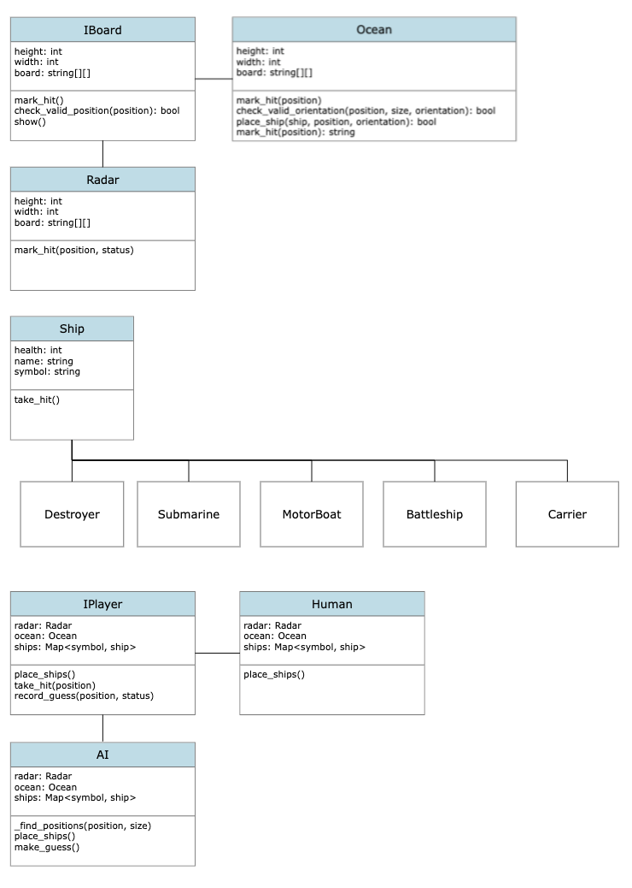
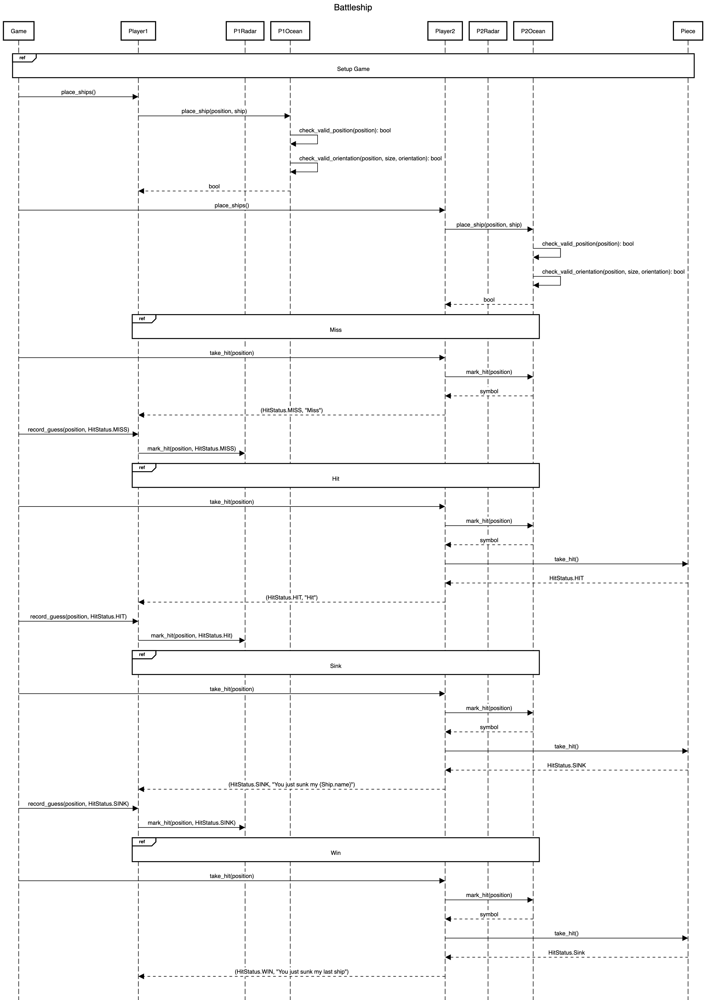

# Object Oriented Battle Ship

### Description

1. The game starts with 2 players. Each player has 2 boards and a set of pieces {Destroyer:1, Submarine:3, Cruiser:3, Battleship:4, Carrier: 5}. One board stores the location of their pieces and the other board marks areas with hits, misses, and unused spots. The players place the pieces on their respective boards and take turns guessing the location of ships on the opponents board. When the player makes a guess, the opponent will return with the possible outcomes: miss, hit, and sink. The player that sinks all their opponent's ships wins.

### Requirements

1. 2 players
2. 2 boards per player
3. 1-5 pieces per player
4. all pieces must be placed before the game begins
5. players take turns guessing
6. all ships on the losing side must be destroyed before a winner can be picked

### Actors

1. Player
2. {Ship:size} -> {Destroyer:1, Submarine:3, Cruiser:3, Battleship:4, Carrier: 5}
3. Radar
4. Ocean
5. Game

### Steps

1. Choose AI or PVP
2. Each player sets their ships
3. Player makes a guess
4. Opponent tells us if its a miss, hit, sink, or win
5. Repeat 3 and 4 until winner is determined

## Object Model

TODO

<!--  -->

## Sequence Diagram

